# Prompt Autocomplete

The outcome of the project is a working app that is hosted on Huggingface spaces
that users can interact with
Link: https://shamima-prompt-generation.hf.space/

Architecture diagram:
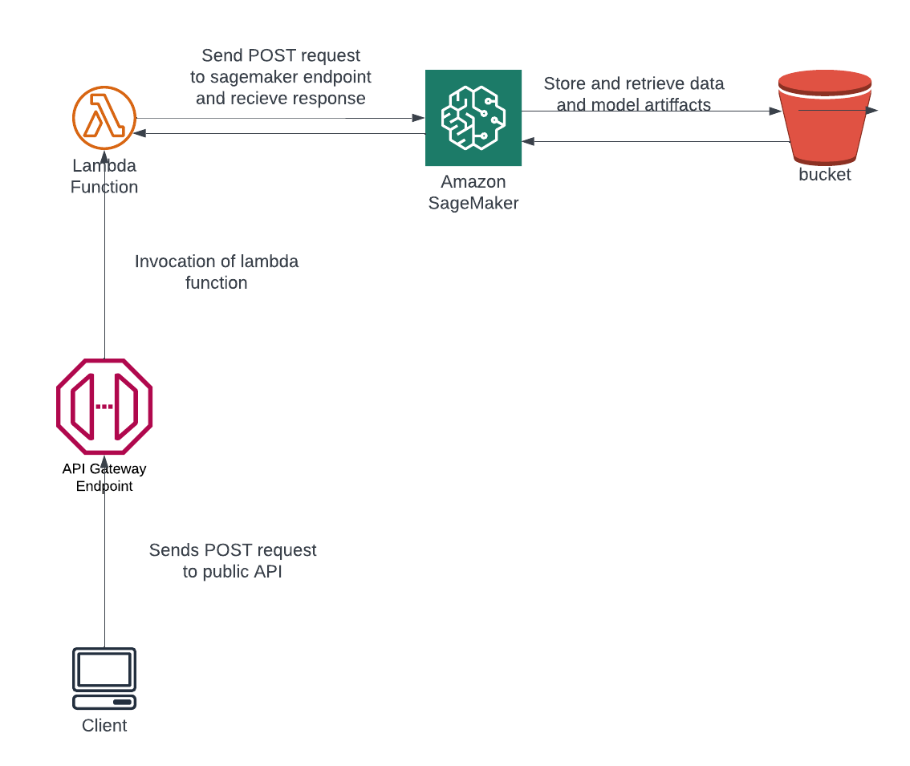

Since the final deployed model is very large to download and upload I have publicly hosted 
the finetuned DistilBert-Roberta model on huggingface Hub here https://huggingface.co/Shamima/diffusion_prompt

### Step 1: Data ETL and deployment on Sagemaker

- **Created SageMaker notebook instance** 
I have opted to use a  ml.t3.medium as it was the cheapest option that provides sufficient capacity to run the notebook.


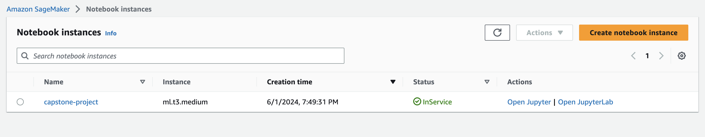

- **S3 bucket** 

I created a bucket called `diffusion-data` to store dataset and a default bucket for model training artifacts 

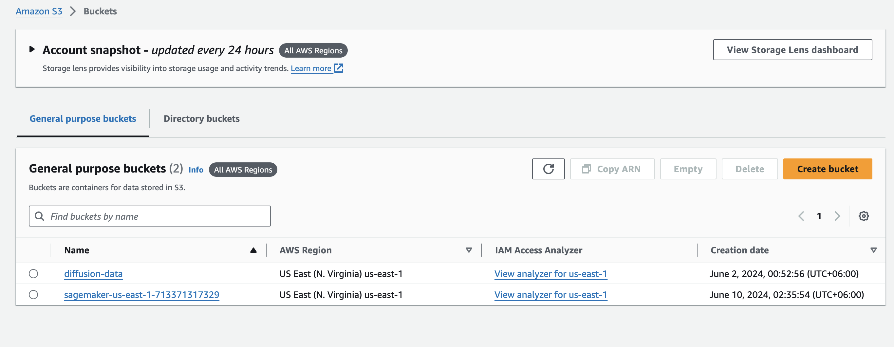
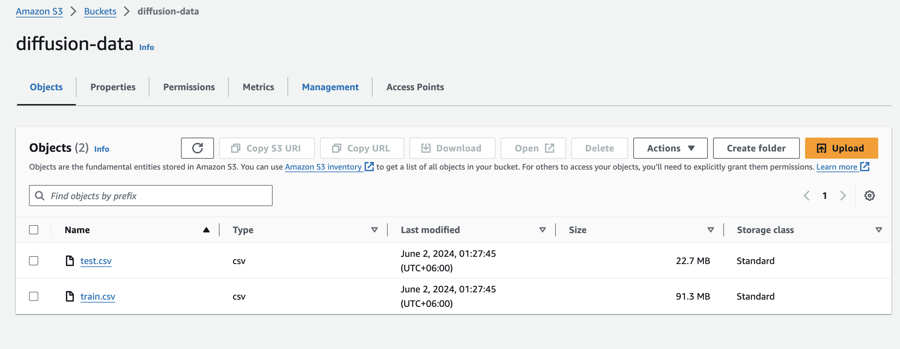


### Step 2 : Model training on Sagemaker
I opted for a `ml.g4dn.xlarge` instance for training both LSTM and the DistilBert-Roberta finetuning. 
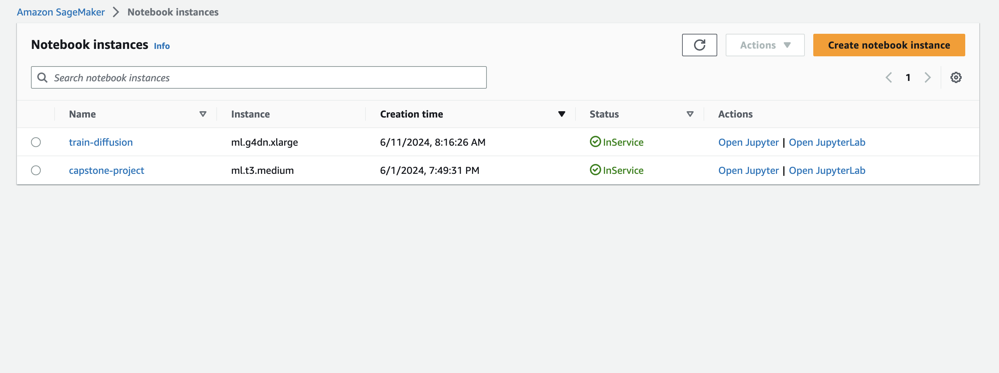

before choosing the best model I inferred using the trained models locally on the sagemaker instance
here's the output for the lstm model training
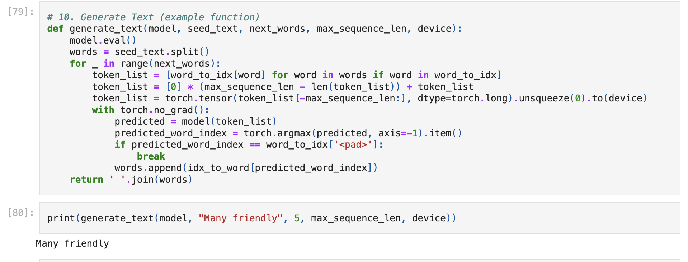

### Step 3: Model deployment

I deployed a real time endpoint on SageMaker endpoints for the finetuned DistilBert-Roberta model using
SageMaker script mode for Huggingface models sagemaker sdk and boto3. 


after deploying the `DistilBert-Roberta` finetuned model here's the endpoint tested locally
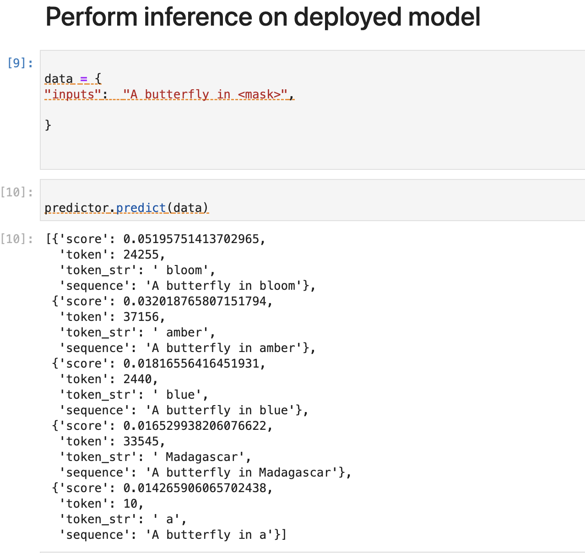

### Step 4: Lambda function creation
Once the model is trained and deployed, setting up a Lambda function becomes an important next step. Lambda functions play a vital role in enabling access to our model and its inferences by APIs and other programs, making it a crucial step in the production deployment process. The lambda function will act as a proxy between the managed endpoint via SageMaker and any other service. Lambda provides an easier interface to interact with the model without needing to worry about SageMaker specific technicalities and lets other services focus on client specific implementations.

We created a lambda function called `generateText` 
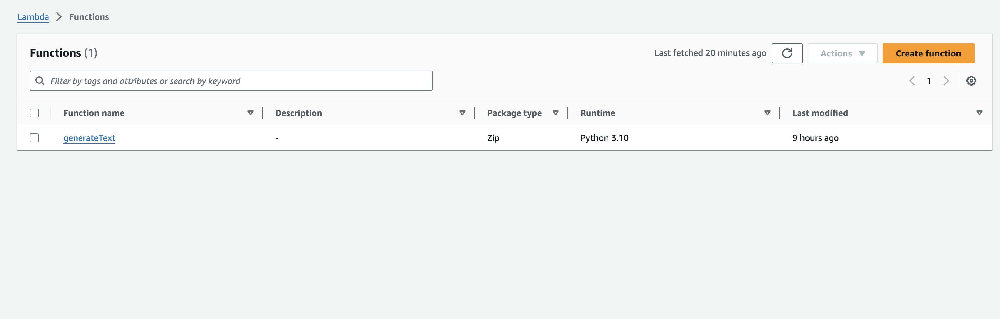
This is the function definition
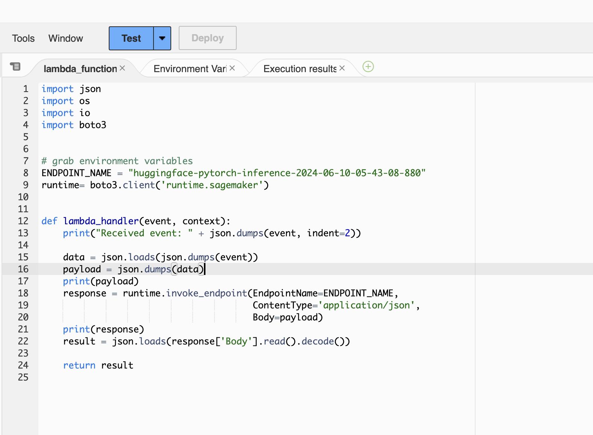


### Step 4: Lambda security setup and testing 

- **Adding SageMaker permission to Lambda Functions**

The lambda function needs proper access and permissions to be able to invoke the endpoint. So there are two related policies needed that needs to be attached to the role that our lambda service assumes

1. Amazon Lambda Full Access - for being able to execute and access functions. Deals with lambda specific operations. 
2. Amazon SageMaker Full Access -  For access SageMaker related services such as deployed endpoints.

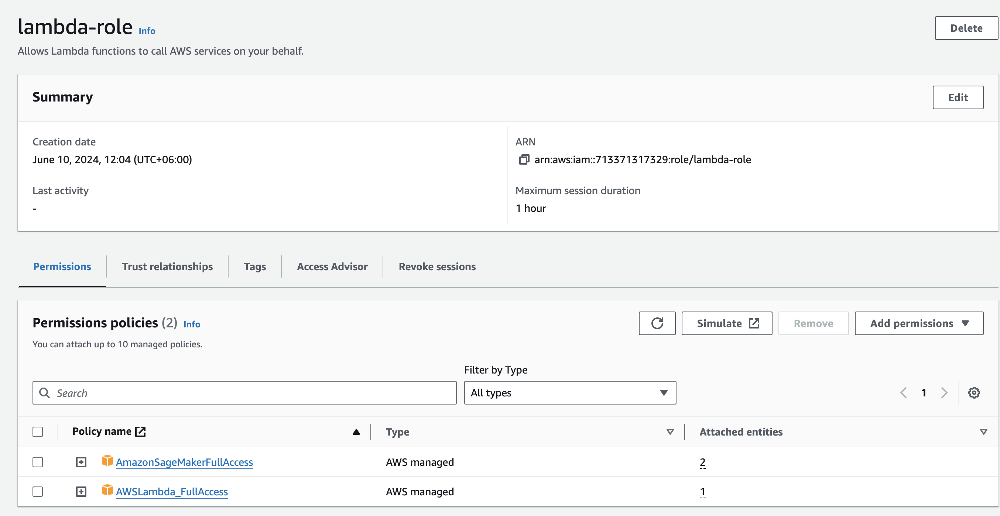

**Vulnerability Assesment** 
- While granting 'Full Access' might resolve the authentication error, it is important to note that this could expose your system to security threats from malicious actors. Therefore, it is best to follow the principle of least privilege, providing only the necessary permissions needed for the task.
- Inactive or outdated roles can compromise the security of Lambda functions. To reduce potential security risks, it is crucial to delete these roles.
- Policies linked to roles that are no longer in use can lead to unauthorized access, posing a security threat. It is advisable to remove these outdated policies to prevent unauthorized access.


- **Testing Lambda Function**
We can test the lambda function with a payload like so 
`{
  "inputs": "A butterfly in <mask>"
}`
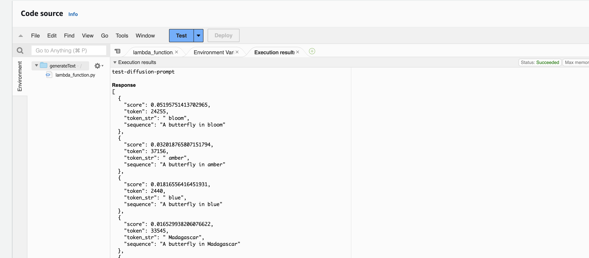

Received Response from lambda
```
Test Event Name
test-diffusion-prompt

Response
[
  {
    "score": 0.05195751413702965,
    "token": 24255,
    "token_str": " bloom",
    "sequence": "A butterfly in bloom"
  },
  {
    "score": 0.032018765807151794,
    "token": 37156,
    "token_str": " amber",
    "sequence": "A butterfly in amber"
  },
  {
    "score": 0.01816556416451931,
    "token": 2440,
    "token_str": " blue",
    "sequence": "A butterfly in blue"
  },
  {
    "score": 0.016529938206076622,
    "token": 33545,
    "token_str": " Madagascar",
    "sequence": "A butterfly in Madagascar"
  },
  {
    "score": 0.014265906065702438,
    "token": 10,
    "token_str": " a",
    "sequence": "A butterfly in a"
  }
]

Function Logs
START RequestId: e1ad0529-1515-4151-9472-e93df380c654 Version: $LATEST
Received event: {
"inputs": "A butterfly in <mask>"
}
{"inputs": "A butterfly in <mask>"}
{'ResponseMetadata': {'RequestId': '1bdb36f0-ad6f-489a-bade-fdee80362bcc', 'HTTPStatusCode': 200, 'HTTPHeaders': {'x-amzn-requestid': '1bdb36f0-ad6f-489a-bade-fdee80362bcc', 'x-amzn-invoked-production-variant': 'AllTraffic', 'date': 'Mon, 10 Jun 2024 06:51:39 GMT', 'content-type': 'application/json', 'content-length': '495', 'connection': 'keep-alive'}, 'RetryAttempts': 0}, 'ContentType': 'application/json', 'InvokedProductionVariant': 'AllTraffic', 'Body': <botocore.response.StreamingBody object at 0x7fdbf5d99510>}
END RequestId: e1ad0529-1515-4151-9472-e93df380c654
REPORT RequestId: e1ad0529-1515-4151-9472-e93df380c654	Duration: 326.05 ms	Billed Duration: 327 ms	Memory Size: 128 MB	Max Memory Used: 70 MB	Init Duration: 355.91 ms

Request ID
e1ad0529-1515-4151-9472-e93df380c654
```
### Step 5: API Gateway creation
Next we configure API Gateway to trigger this Lambda function by setting up a REST API.

Substeps create API gateway
Create an api called `text-generation` from the AWS API Gateway resource page.
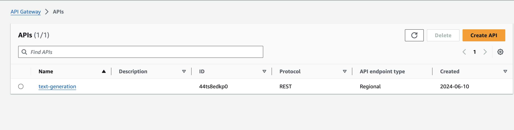

Create a POST route for the API since we want to make POST requests to the API

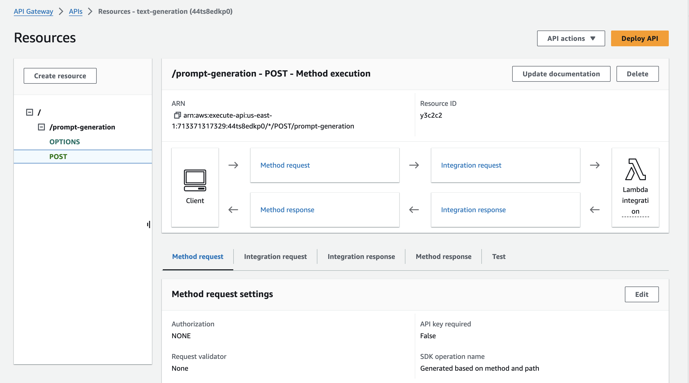

Deploy the API for production with the configured routes

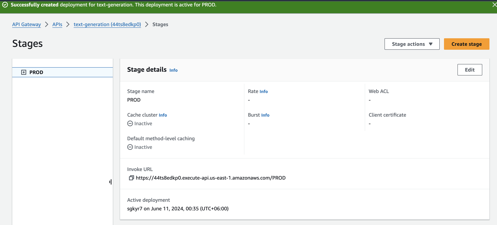

Finally test out our deployed API that is publicly exposed
Here I made a CURL request from my terminal and recieved a response

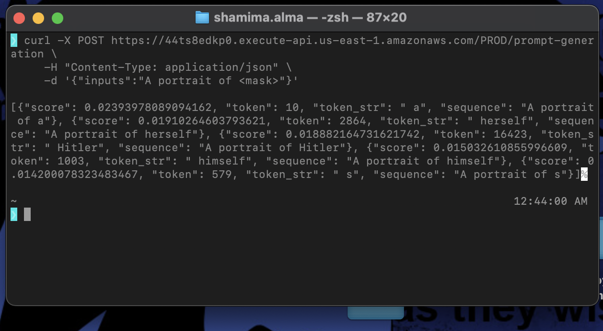

The architecture diagram after connecting API Gateway with Lambda function looks like this 

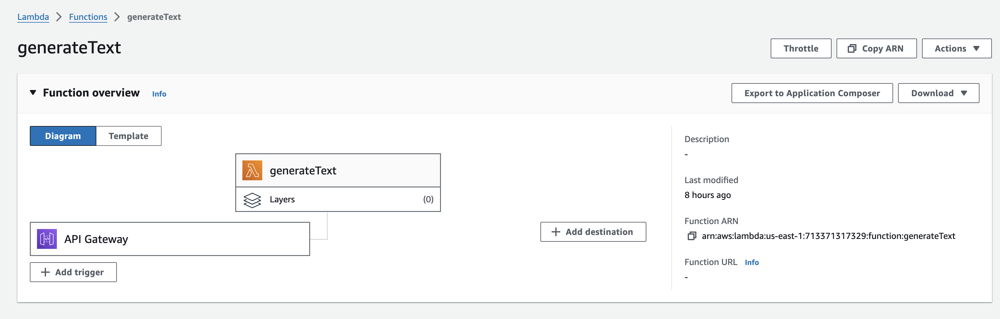

### Step 6: Create a public HuggingFace space to host a gradio app

I created a gradio app that allow users to interact with the application and get
prompt autocompletion interactively
Public link to gradio app: https://huggingface.co/spaces/Shamima/prompt-generation

Examples of the working app:

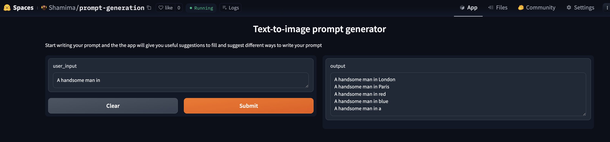

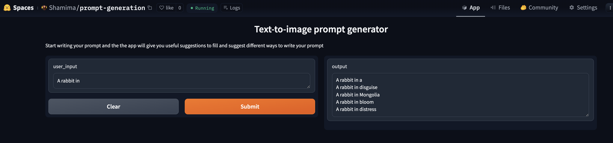